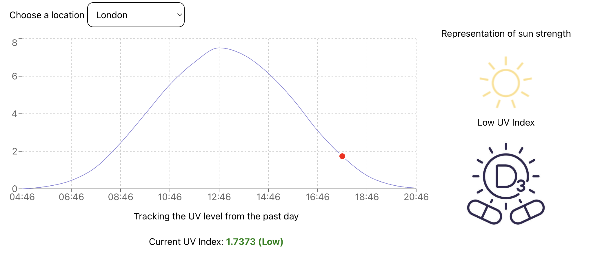

##UV Monitoring Dashboard



Technology used: - Next.js - React - Recharts - Javascript - React Test Library - Jest.

To run the application use: ```yarn dev``` or ```npm run dev```

Open [http://localhost:3000](http://localhost:3000) with your browser to see the Dashboard.

To run the tests use: ```yarn test``` or ```npm run test```

I used Next.js the framework for this application as I am quite comfortable using it and have built a few things with it in the past.

In terms of API I tried using [OpenWeatherMap](https://openweathermap.org) as I noticed it had quite a vast amount of information. After a few attempts I realised that you have to pay for the oneCall service. 

Having tried various things I ended up using their Geocoding API to decifer lat, lng and used [OpenUV](https://www.openuv.io/) to gather the UV Data.

For Recharts I watched a bit of a tutorial from Web Dev Simplified as I hadn't used this library before. I was amazed at how little it took to get it running. Here is a link to the video if you are interested: [Recharts video](https://www.youtube.com/watch?v=15qMh8C1Wzo)

For development purposes I set up some mock data which I copied from openuv as I was worried about hitting the 50 api call limit during development. You can manually change the day variable in lib/data.js to make it work correctly.

I also added a basic feature switch ```useMockData``` for the api so you can choose whether to use the mock data or use the openuv api.

I also left in a mock uv value ```testVal``` so you can manually change the images to see what happens when theres a higher UV. You will need to uncomment the following in: pages/index.js:

```
{/* <UVCurrent value={testVal} /> */}
{/* <UVImage value={testVal} /> */}
```
Make sure to comment out the others so it doesn't affect the layout.

For the initial design I had two components in mind which was the main graph and the drop down country selector.

I ended up adding two more, one for the current uv raiting text under the graph and one for the two images one on the side.

Here is the final design I mocked up using Figma just as a basic layout:


Other Feature Ideas:

- App background colour changing based on UV level.
- Sun animation changes based on UV level
- Adding a UV level indiscation Bar from low to extreme

## Deploy on Vercel

The easiest way to deploy your Next.js app is to use the [Vercel Platform](https://vercel.com/new?utm_medium=default-template&filter=next.js&utm_source=create-next-app&utm_campaign=create-next-app-readme) from the creators of Next.js.

Check out our [Next.js deployment documentation](https://nextjs.org/docs/pages/building-your-application/deploying) for more details.
